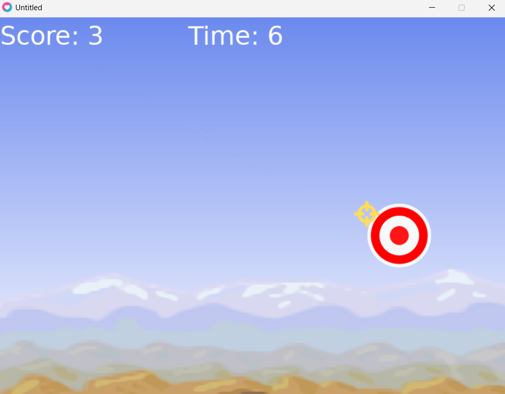

## 🛠 Requirements

- [Love2D (version 11.x)](https://love2d.org/)
- Compatible with Windows, macOS, and Linux.

## 🚀 How to Run

1. **Download Love2D**: https://love2d.org/
2. **Clone this repo** or [download the ZIP](https://github.com/your-username/target-practice-game/archive/refs/heads/main.zip)
3. Run the game:
   - Option 1: Drag the project folder onto the `love.exe`
   - Option 2 (CLI):

     ```bash
     love .
     ```

## 📸 Screenshot



## ✨ Features

- Game Over & Restart functionality
- Custom mouse crosshair
- Random target positioning
- Background sprite and UI score display

## 🧠 Learnings

This project teaches:
- How to structure a basic game in Love2D
- Managing game states (menu, active, game over)
- Collision detection and distance calculation
- Sprite rendering and UI elements

## 📄 License

This game is released under the [MIT License](LICENSE). Feel free to fork, modify, and share!

---

Happy coding & shooting! 🎯
